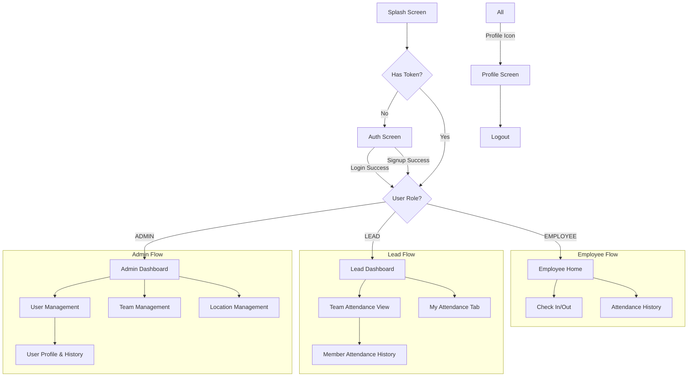

# UI/UX Plan: Geo-Attendance System

> **Role:** Lead UI/UX Architect
> **Objective:** Define the visual and structural architecture for the EMS mobile application.

---

## 1. Screen Flow & Navigation Architecture

The application uses a **Role-Based Dynamic Routing** strategy.



---

## 2. Wireframe-Level Layouts

### 2.1 Auth Screen
*   **Layout:** Single ScrollView with centralized content.
*   **Elements:**
    *   Logo (Top, centered, ~15% screen height)
    *   TabBar (Login | Sign Up)
    *   **Login Tab:** Mobile Input, Password Input, "Login" CTA (Primary Color).
    *   **Signup Tab:** Full Name, Mobile, Password, Confirm Password, "Create Account" CTA (Secondary Color).
    *   *Feedback:* SnackBar for errors/success.

### 2.2 Employee Home (The "Daily Driver")
*   **Layout:** Vertical Column with Card-based separation.
*   **Header:** "Welcome, {Name}" + Date + Profile Avatar (Top Right).
*   **Hero Section (Action):** Large, prominent Status Card.
    *   *State A (Not Checked In):* Green "CHECK IN" button (60% width).
    *   *State B (Checked In):* Timer/Status showing "Checked In at {Time}". Red "CHECK OUT" button.
    *   *State C (Completed):* "Day Complete" Summary Card (Hours worked).
*   **History Section:** "Recent Activity" list.
    *   *List Item:* Date (Left) | Status Badge (Right) | In/Out times (Subtitle).

### 2.3 Lead Dashboard
*   **Navigation:** BottomNavigationBar (Team | My Attendance).
*   **Tab 1: Team View**
    *   **Filter Row:** Date Picker | Status Filter (All/Present/Late/Absent).
    *   **Stats Row:** Card showing "X Present", "Y Absent".
    *   **List:** Member Cards.
        *   *Avatar + Name*
        *   *Status Badge (Dot)*
        *   *Action:* Tap to view specific member history.
*   **Tab 2: My Attendance**
    *   Reuses **Employee Home** widget tree.

### 2.4 Admin Dashboard
*   **Navigation:** Drawer or BottomNav (Overview | Users | Teams | Locations).
*   **Overview:** High-level charts (Attendance Rate, Active Users).
*   **Management Screens (List + FAB):**
    *   *List View:* Searchable lists of entities.
    *   *Floating Action Button (FAB):* "+ Add New".
    *   *Edit/Delete:* Swipe actions or detailed view context menu.

---

## 3. Component Tree & Hierarchy

A modular approach to maximize code reuse.

```text
App
└── MultiProvider (Auth, Attendance)
    └── MaterialApp
        └── AuthWrapper (State: Loading/Unauth/Auth)
            ├── AuthScreen
            │   ├── LoginForm
            │   └── SignupForm
            ├── AdminDashboard
            │   ├── StatCard
            │   ├── EntityList<T> (Generic Reusable)
            │   └── ManagementFab
            ├── LeadDashboard
            │   ├── TeamStatsSummary
            │   └── MemberListTile
            └── EmployeeHomeScreen
                ├── UserWelcomeHeader
                ├── CheckInActionCard (Complex State)
                │   ├── LocationStatusIndicator
                │   └── BigActionButton
                └── AttendanceHistoryList
                    └── HistoryItemTile
```

---

## 4. State Management Strategy

Using **Provider** pattern for reactive state.

### 4.1 Global Scope
*   **AuthProvider:**
    *   `user`: Current User object (persisted).
    *   `token`: JWT.
    *   `login()` / `signup()` / `logout()`.
    *   `role`: Derived getter for routing.

### 4.2 Feature Scope
*   **AttendanceProvider:**
    *   `todayAttendance`: Single object, nullable.
    *   `history`: List<Attendance>.
    *   `isLoading`: bool.
    *   `checkIn(lat, long)`: Optimistic update -> API call -> Rollback on fail.
*   **AdminProvider (Future):**
    *   Cache lists of Users/Teams to minimize refetching.

---

## 5. Design Specifications

### 5.1 Color Palette (Professional & Trust)
*   **Primary:** Royal Blue `#2563EB` (Actions, Headers)
*   **Secondary:** Emerald Green `#10B981` (Success, Check-In)
*   **Destructive:** Rose Red `#F43F5E` (Error, Check-Out, Delete)
*   **Background:** Slate Gray `#F1F5F9` (App Background)
*   **Surface:** White `#FFFFFF` (Cards)

### 5.2 Typography
*   **Font Family:** Inter or Roboto (System Default).
*   **Headings:** Bold, high contrast (Size 20-24).
*   **Body:** Regular, dark grey (Size 14-16).
*   **Captions:** Grey, small (Size 12).

---

## 6. Accessibility (a11y) & UX

1.  **Semantic Labels:** All ImageIcons and FABs must have `semanticLabel` or `tooltip`.
2.  **Touch Targets:** Minimum 48x48 logical pixels for all tap targets (Buttons, ListTiles).
3.  **Feedback:**
    *   *Haptic Feedback* on long presses or successful Check-In.
    *   *Visual Feedback:* Ripples (InkWell) on all interactive elements.
    *   *Loading States:* Skeleton loaders instead of blocking spinners where possible.
4.  **Error Handling:**
    *   Never show raw exception messages. User-friendly "Try Again" toasts.
    *   Location permission denied -> Show specific instruction dialog, not just "Error".

## 7. Mobile Responsiveness
*   **SafeArea:** Wrap all top-level scaffolds.
*   **Keyboard Handling:** Use `SingleChildScrollView` + `Padding(bottom: MediaQuery.of(context).viewInsets.bottom)` for forms to prevent overflow.
*   **Flexible Layouts:** Use `Flex`, `Expanded`, and `Wrap` to handle different screen widths (e.g., tablet vs phone).
